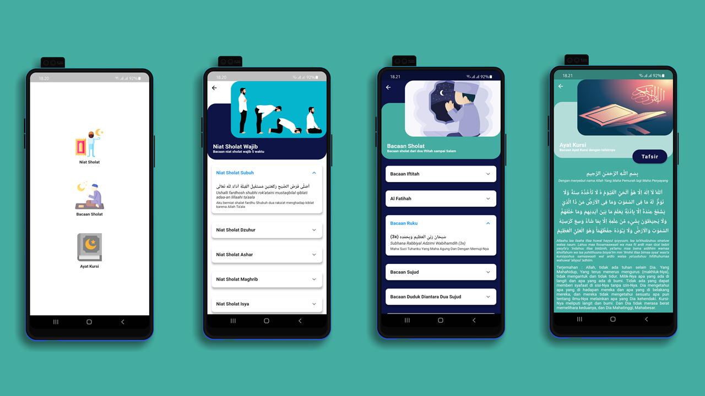

## Membuat Aplikasi Bacaan Sholat dengan Flutter
Berisikan Niat-niat Sholat Wajib, Bacaan Sholat dan Ayat Kursi

# Tutorial Build with Visual Studio Code
* https://youtu.be/-GFtOEAO5kg (Part 1)
* https://youtu.be/bolzAZyD8Qg (Part 2)
* https://youtu.be/cXi-1KJwJdg (Part 3)
* https://youtu.be/g8ame1KPhcI (Part 4)



Sebelumnya sudah pernah saya buat dengan versi Native Kotlin, bisa liat tutorial dan demo aplikasinya disini https://github.com/AzharRivaldi/BacaanSholat

****If you use the Source Code, please make sure to credit and backlink to [Azhar Rivaldi](https://rivaldi48.blogspot.com/)***

## 👇 Click For Support Me :
<a href="https://sociabuzz.com/azharrvldi_/donate"> 
</a>

## 📄 License

```
Copyright (C) Azhar Rivaldi

    Licensed under the Apache License, Version 2.0 (the "License");
    you may not use this file except in compliance with the License.
    You may obtain a copy of the License at

    http://www.apache.org/licenses/LICENSE-2.0

    Unless required by applicable law or agreed to in writing, software
    distributed under the License is distributed on an "AS IS" BASIS,
    WITHOUT WARRANTIES OR CONDITIONS OF ANY KIND, either express or implied.
    See the License for the specific language governing permissions and
    limitations under the License.

```
